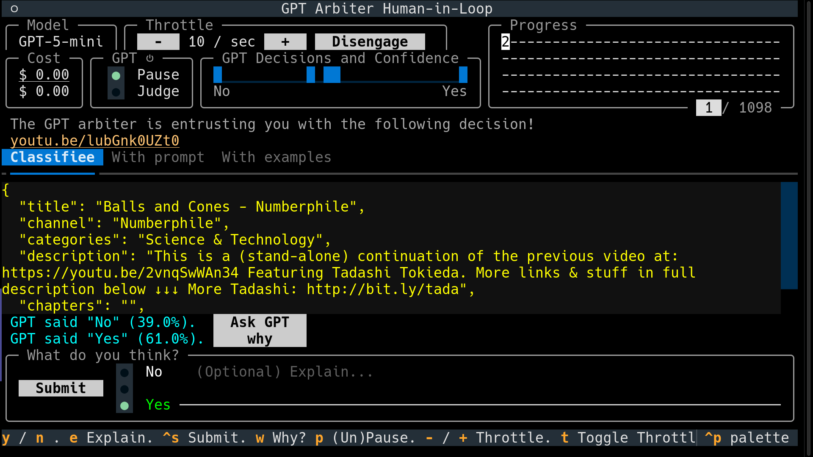

# GPT Arbiter Human-in-Loop

- Classify items according to your prompt and examples.  
  - e.g. [Which papers in this database are relevant to...?](https://github.com/Daniel-Chin/GPT-lit-reviewer)  
  - e.g. [Which YouTube videos in this metadatabase look like music?](https://github.com/Daniel-Chin/sync-my-youtube-playlists)  
- The GPT model outputs one token, saving costs.  
- The output token's logits represent its confidence.  
- Low-confidence decisions query the human user for labeling. Labels are added to the prompt as in-context examples.  

## More features
- Cached API responses save costs when you rerun after interruption.  
  - With cache key as the full prompt and model selection, ensuring validity.  
- Terminal ascii GUI (with `textual`):  
  - Displays in realtime the histogram of decisions+confidence.
  - Displays in realtime the database coverage, using different symbols to represent "unvisited", "visited with latest prompt", "visited with stale (-3) prompt", etc.
  - Displays the estimated total cost in USD.  
    - shwos you how many examples are too many examples. 
  - Accepts user commands to:
    - label the current query.
      - Optionally interrogate the model for its rationales (2-way).
      - Optionally explain the reason.  
    - Set throttling.
    - Pause/resume background classification.
  - Preview prompts from the perspective of ChatGPT.
- Query selection balances uncertainty and recency.
  - Old uncertainty may have already been addressed.
  - Hyperparam: data diversity $\Lambda$. Its inverse, $1 / \Lambda$, equals the probability that labeling A significantly explains B, where A and B are independently drawn from the data distribution.
  - The average information gain of querying a datapoint currently classified k queries ago with probability simplex (p, 1-p) is therefore $H_2(p)(1-1/\Lambda)^k$ where binary entropy $H_2(p) = -p log_2(p) - (1-p) log_2(1-p)$

## Gotchas
- OpenAI exposes no pricing API, so the unit price may get outdated. See [pricing.py](./src/gpt_arbiter_human_in_loop/pricing.py)

## Not planned yet
- Use ChatCompletion during the interactive stage and hand it off to BatchAPI for the automatic stage.
- Support more-than-2-way classification.
  - GUI. In binary classification, one hist represents decisions+confidence. In multi classification, one hist shows the confidence and one 100% stacked bar chart shows the decisions.
- What if the model is confidently wrong? Set fixed prob of unconditioned sampling queries for human.

## dev notes
- Git branch "Downgrade-async-openai-to-plain-openai-for-cachier.-Revert-this-branch-once-cachier-supports-coroutines"
  - https://github.com/python-cachier/cachier/issues/27
